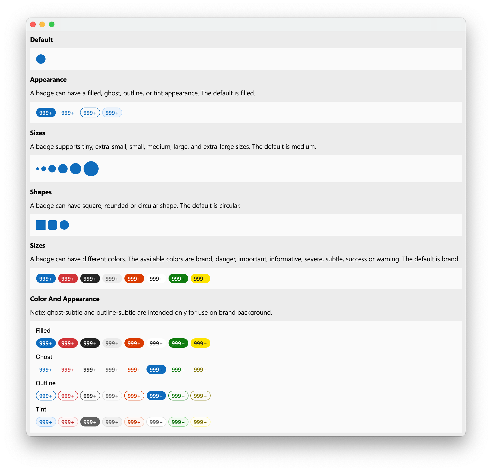

# fluentui_qt
A collection of UX frameworks for creating beautiful, cross-platform apps that share code, design, and interaction behavior, which is implemented using Qt.  
**I'm not a professional. I just want to do this.**

## Components

- [ ] Avatar
- [x] Badge
- [ ] Button
- [ ] Icons

## Gallery
All examples to show what a Fluent UI components looks like.

